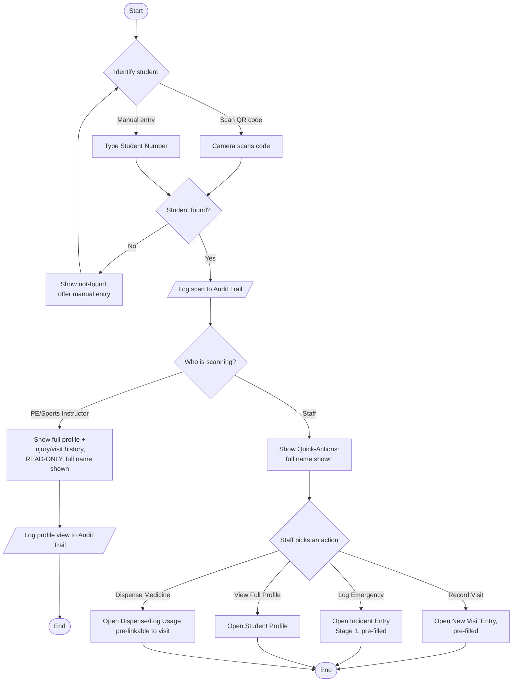
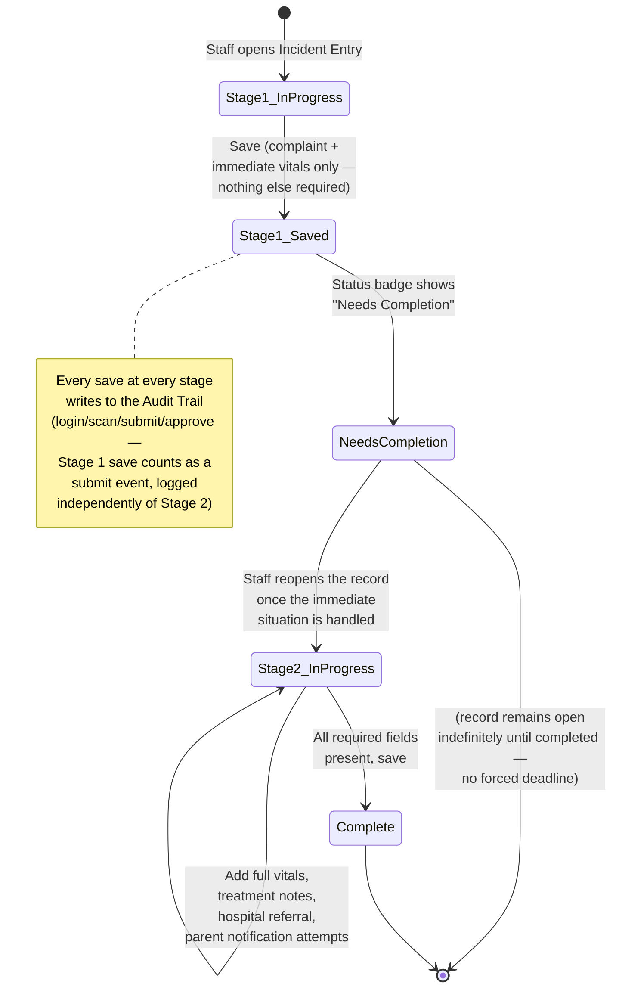
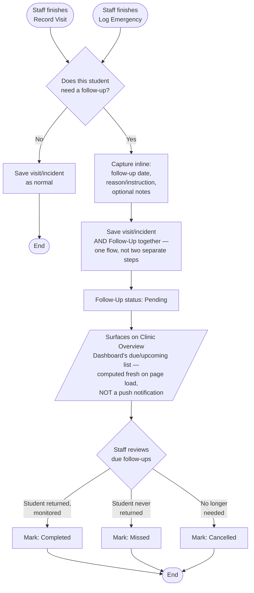

# Activity Diagrams

**Status: first draft, built from already-documented requirements.** These three flows were identified (in this same file, before this draft existed) as the highest-priority candidates — the ones with the most non-obvious branching logic already written out in prose across the Frontend Context Brief, Frontend Design Reference, and Modules & Features. Built directly from that prose, not invented.

## 1. QR Scan → Action Flow

Covers both Staff (full access, computer or mobile) and PE/Sports Instructor (mobile, read-only) — the branch point is the role, checked immediately after identification.

**Separately, the mobile Emergency button** (Staff only) bypasses this whole flow when speed matters most — it jumps directly to Incident Entry Stage 1 if a scan already happened, rather than routing through the Quick-Actions menu.

## 2. Two-Stage Emergency Response Flow

The clearest case of a genuine state machine in the whole system — modeled as one, not a linear flowchart.

**Why this matters as its own diagram:** the entire design rationale for the two-stage flow is "speed over completeness in the first moment" — a flowchart that treated this as one linear "fill out the incident form" process would misrepresent the actual requirement. The state diagram makes explicit that `NeedsCompletion` is a real, potentially long-lived state, not a transient step.

## 3. Follow-Up Handling Flow

Shared between Clinic Visit Monitoring and Emergency Response — same feature, two entry points, converging on one flow.

**The one design constraint this diagram exists to make visible:** the "surfaces on Dashboard" step is explicitly a *pull* mechanism (Staff has to look), not a *push* one — there's no background job or notification service anywhere in this architecture (Project Plan §1.4, SMS/push explicitly out of scope). Any implementation that tries to add a scheduled reminder job would be solving a problem this flow was deliberately designed not to need.

## Notes

- These three aren't the *only* flows in the system — they're the three worth diagramming first because they're the ones with real branching/state logic. Most other flows (a standard CRUD form, a report generation) are straightforward enough that a diagram would just restate the obvious.
- If a new flow gets added later with comparable complexity (the barcode-scanner proposal, if it's ever approved, likely qualifies), add it here rather than leaving it undiagrammed.
