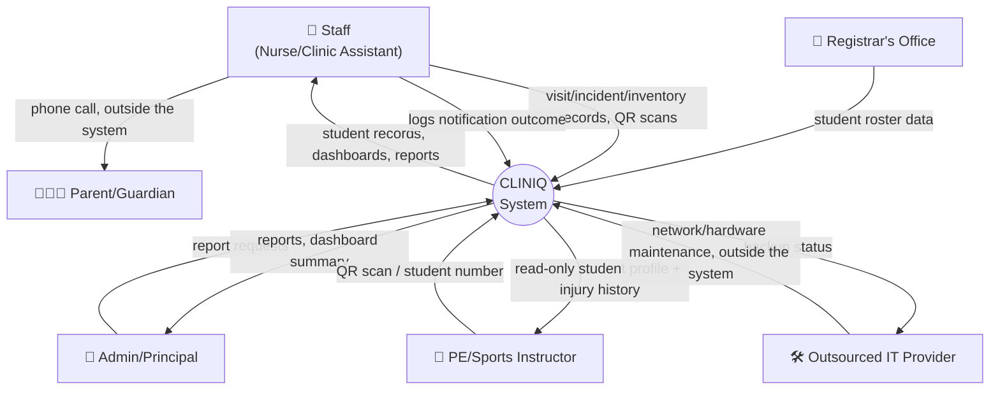
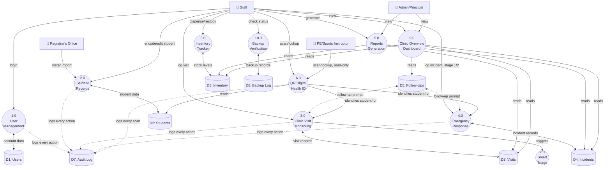

# Data Flow Diagram

**Status: first draft, built from already-documented requirements.** External entities come directly from the Project Plan's External Interfaces table (§2.1); processes map directly to the 10 modules already fully specified in Modules & Features. Not waiting on an external SRS — this is that artifact's first draft.

## Level 0 — Context Diagram

The whole system as one process, showing everything that crosses its boundary.

Note the two flows drawn as "outside the system": the actual parent phone call and the physical hardware maintenance both happen outside CLINIQ by design (Project Plan §1.4 — no parent portal, no automated notifications) — only their *outcomes* (a logged notification attempt, a backup status Staff can see) cross back into the system.

## Level 1 — Major Processes

Breaking the single CLINIQ process into its constituent modules and data stores.

Dotted lines into `D7: Audit Log` represent the cross-cutting requirement that every module writes to it — not a data flow specific to any one process (Modules & Features, "Audit Trail" section; `.claude/skills/cliniq-audit-trail/`).

## Notes

- Smart Triage (7.0) has no data store of its own — it's a stateless lookup (complaint type → checklist content) surfaced inside Visit Monitoring, not a persisted record, matching how it's described in Modules & Features ("not a standalone page — a checklist panel embedded in New Visit Entry").
- Follow-Up (D5) is drawn as shared between Visit Monitoring and Emergency Response, since a follow-up can originate from either — matches the "same feature, two entry points" note already established.
