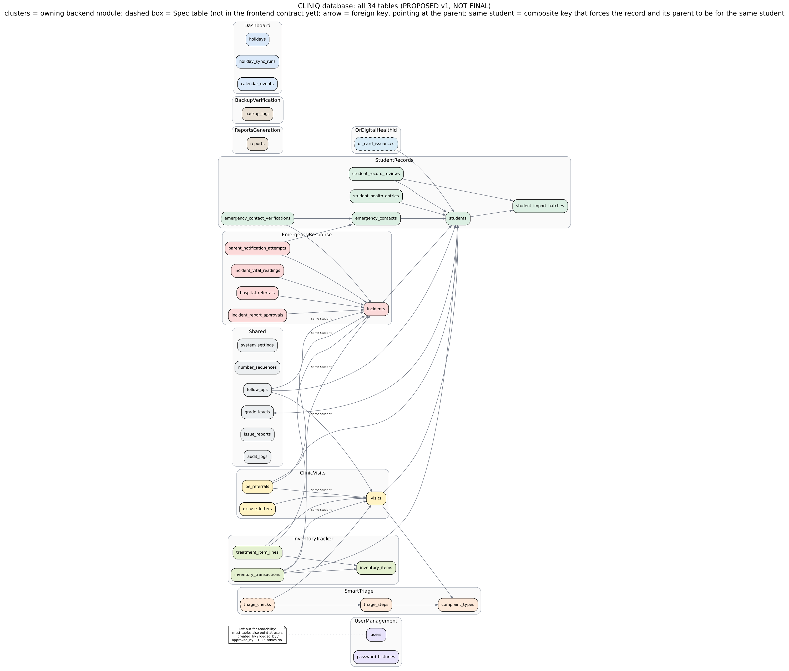
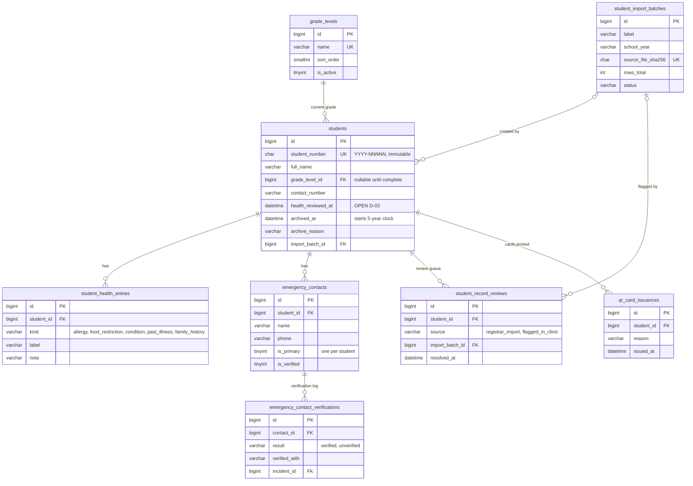
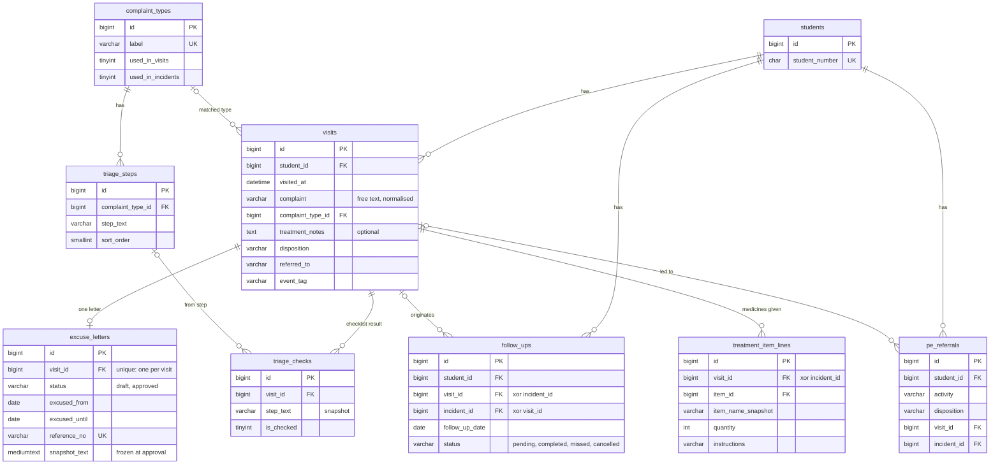
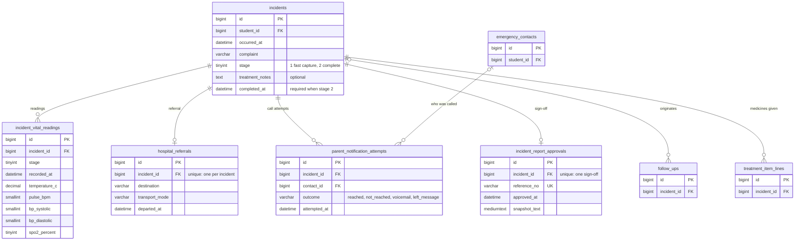
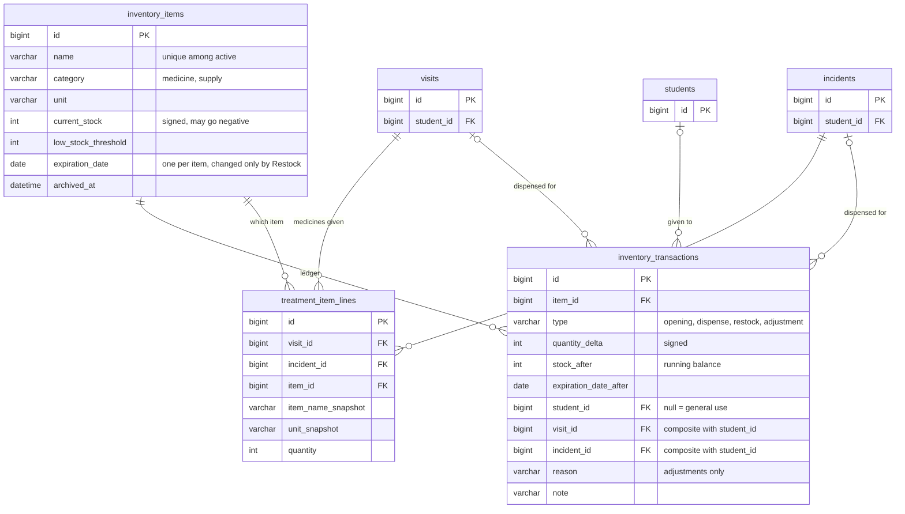
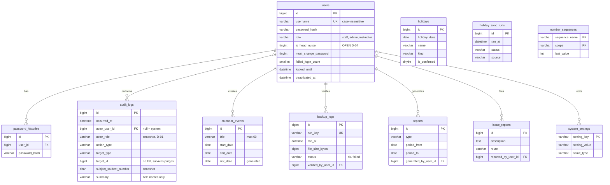

# Entity-Relationship Diagram

> **STATUS: PROPOSED v1. NOT FINAL.** Drafted Friday, October 09, 2026 — 00:29 PHT; updated 02:11 PHT. This is a design for the team to review, **not** an accepted decision and **not** a licence to start migrations. Tables, columns and rules can still change once the open decisions in section 11 are answered. After the team reviews it, record the outcome as an ADR and change this banner to say which version was approved. Until then the old guidance still holds: do not build the backend schema from the frontend entity list, and do not treat anything here as settled.

This file replaces the old "TBA" placeholder. For the wider readiness picture (API contract, auth, backups, pinned versions and so on) see `04-Development/Backend-Readiness-Checklist.md`.

What backs it up:

- `Reference-Schema.sql` (same folder) is the reference DDL. It was loaded into a real MariaDB 10.11 and passed **107 constraint tests** (bad data rejected, good data accepted, delete behaviour, atomic number generation).
- It was then loaded with a stress volume (**150,000 visits, 25,000 incidents, 1,500,000 audit rows**, the worst-case assumptions from the planning discussion) and the dashboard, calendar, audit-viewer and list queries each ran in **under 30 ms**.
- `Data-Dictionary.md` (same folder) is generated from that same database, so it cannot disagree with the DDL.

Built from the live repo at `origin/main` `e63728b`: `Module-Overview.md`, ADR-005/009/014/015/016/017/018/019/020, `Data-Retention-Policy.md`, the mock data layer (`frontend/src/lib/mock-db/api.ts`, `types.ts`, `integrity.ts`, `mock-db.json`) and `frontend/src/types/entities.ts`.

---

## 1. Design goals and how the design meets them

| Goal | What the design does about it |
|---|---|
| **Correct** | Business invariants that can be expressed in SQL are enforced by the database (CHECKs, composite foreign keys, unique and generated-column indexes), not just by the app. 107 tests prove they reject what they should. |
| **Flexible** | Things that change (grade levels, complaint types, triage steps, thresholds, health-entry kinds) are rows, not code or enums. Several contacts per student, several vital readings per incident, several health entry kinds are supported without schema change. |
| **Scalable** | Surrogate `BIGINT` keys, narrow indexes shaped to the real screens, no JSON blobs to scan, no views. Measured at 10x the realistic volume. See section 10. |
| **Maintainable** | One naming convention, one FK policy, one place for each fact. Derived values are never stored. Every table has an owning backend module. The dictionary is generated, not hand-kept. |
| **Auditable (RA 10173)** | History is append-only (ledger, audit log, vital readings, notification attempts, verification events). Snapshots protect permanent documents. Records are archived, never casually deleted; one purge procedure does the 5-year deletion. |
| **Portable** | Runs on MariaDB 10.4+ (what XAMPP ships) **and** MySQL 8.0.16+. No triggers, views, stored procedures, JSON columns, window functions or engine-specific collations. |

Important fact worth stating early: **XAMPP ships MariaDB, not MySQL.** `Environment-Setup.md` and the Project Plan say "MySQL". Laravel connects to MariaDB through its MySQL driver and everything here works on both, but the team should write "MariaDB (XAMPP)" in the setup docs so nobody installs a different engine on the dev machines. The collation `utf8mb4_0900_ai_ci` (MySQL 8's default) does not exist in MariaDB, which is why this design pins `utf8mb4_unicode_ci`.

---

## 2. Conventions (the rules every table follows)

**Keys**

- **K-1.** Every table has `id BIGINT UNSIGNED AUTO_INCREMENT` as its primary key. It is internal: the UI never shows it (display rules already forbid internal ids). The API may return it as a string. Exceptions: `system_settings` (key is `setting_key`) and `number_sequences` (composite key).
- **K-2.** A student is *identified to people* by `student_number`, which is unique and **immutable** (it is printed on QR cards). Foreign keys use `students.id`, not the number, so a correction could never cascade through millions of rows. This resolves the mock's inconsistency (seed uses Student Number, entities use `id`).
- **K-3.** If the project ever needs offline sync or multi-site merging, switch ids to ULIDs; nothing else in the design depends on the id type.

**Time**

- **T-1.** Every `DATETIME` is **Philippine time (UTC+8)**, and Laravel's `app.timezone` and the DB session `time_zone` are both set to `+08:00`. The Philippines has no daylight saving, so this is stable. Reason: with UTC storage a visit at 07:00 on Oct 9 lands on Oct 8 and every "visits per day" count is wrong, and XAMPP's MariaDB does not ship timezone tables, so `CONVERT_TZ` with named zones silently returns NULL.
- **T-2.** Use `DATETIME`, not Laravel's default `TIMESTAMP`, for all timestamp columns (define one `clinicTimestamps()` macro). `TIMESTAMP` stops at 2038, inside this system's plausible life.
- **T-3.** Calendar-only facts (follow-up date, excused period, holiday, event) are `DATE`. The API sends ISO-8601 with `+08:00`, matching the mock.

**Text and domains**

- **C-1.** `utf8mb4` / `utf8mb4_unicode_ci` everywhere: case- and accent-insensitive, so "Nuñez" matches "nunez" (good for duplicate warnings and search) and "Headache"/"headache" never split a GROUP BY.
- **D-1.** Small fixed domains are `VARCHAR` + `CHECK ... IN (...)`, with a PHP backed enum in code. Not MySQL `ENUM`: altering an `ENUM` is painful in Laravel migrations and engines differ.
- **D-2.** Rule for choosing: if Staff might add a value without a developer (grade levels, complaint types), it is a **lookup table**. If a value changes behaviour in code (disposition, follow-up status), it is a **CHECKed domain**.

**History and derived data**

- **L-1.** Event history is append-only: `inventory_transactions`, `audit_logs`, `incident_vital_readings`, `parent_notification_attempts`, `emergency_contact_verifications`. A correction is a new row.
- **L-2.** Permanent documents carry a **snapshot** (`excuse_letters.snapshot_text`, `incident_report_approvals.snapshot_text`; item name and unit on `treatment_item_lines`) so a later rename or grade change cannot rewrite them.
- **L-3.** **Derived values are never stored**: record-complete, low-stock, nearing-expiry, expired, below-zero, follow-up due state, frequent visitor, symptom cluster, report data, calendar counts. The mock already works this way (`integrity.ts` rejects stored derived fields) and so should the API. The only denormalized values are `inventory_items.current_stock`, `emergency_contacts.is_verified` and `inventory_transactions.stock_after`, each maintained by one service and checkable by a nightly job (section 8).

**Foreign keys and deletes**

- **F-1.** Default `ON DELETE RESTRICT`. `CASCADE` is used only for pure profile parts that cannot exist without their student (`student_health_entries`, `emergency_contacts`, `student_record_reviews`, `qr_card_issuances`, `emergency_contact_verifications`) and for `password_histories`. Clinical records are never removed by a cascade.
- **F-2.** Tables whose CHECKs touch FK columns use RESTRICT only. MySQL 8 rejects some referential actions on columns used in a CHECK (error 3823); RESTRICT sidesteps that on both engines. The retention purge is therefore an explicit, ordered procedure (section 7).
- **F-3.** **Composite foreign keys guarantee "same student".** `visits` and `incidents` have `UNIQUE (id, student_id)`, and `follow_ups`, `pe_referrals` and `inventory_transactions` reference `(visit_id, student_id)` / `(incident_id, student_id)`. The database itself then refuses a follow-up or medicine dispense that points at another student's visit.
- **F-4.** No global soft-delete. Domain archiving is explicit: `students.archived_at`, `inventory_items.archived_at`, `users.deactivated_at`. Visits and incidents can't be deleted or voided anywhere in the product, so they have no delete column; if voiding is ever added it must return stock through adjustments (ADR-018).

**Validation layering**

- **V-1.** The database guards *shape and invariants*; the Laravel service layer enforces *workflow* (who may do what, time-dependent rules such as "expired items can't be dispensed", stage transitions, immutability of approved letters). Each side has tests (Pest for services, the SQL tests for constraints).
- **V-2.** A CHECK passes when it evaluates to NULL. Two checks in the first draft silently accepted bad data for exactly this reason (the 107 tests caught both). Write "both or neither" as `(a IS NULL) = (b IS NULL)`, and when a rule needs a value to exist add `IS NOT NULL` explicitly.

**Ownership**

- **M-1.** Each table is owned by one backend module (ADR-009). Other modules read through that module's service, never by querying its tables directly. The mapping is in the dictionary. This extends the ADR-009 list with the two modules it is missing (Smart Triage, Audit Log Viewer) and a `Shared` area.

---

## 3. Entity diagrams

Foreign keys to `users` (`created_by_user_id`, `logged_by_user_id`, `approved_by_user_id`, and so on) exist on most tables and are left out of the diagrams to keep them readable. They are in the dictionary.

### 3.0 Picture of the whole database

Rendered images live in `Diagrams/` (PNG to view, SVG to zoom, `ERD-Overview.dot` is the Graphviz source). The image is generated from the foreign keys in the tested database, so it matches `Reference-Schema.sql`. Boxes are grouped by owning backend module; a dashed box is a `Spec` table (the requirements ask for it but the frontend contract does not carry it yet). The Mermaid diagrams below show the same relationships with key columns, and GitHub renders them directly. If you change the design, redraw both.

| Image | What it shows |
|---|---|
| `Diagrams/ERD-Overview.png` / `.svg` | All 34 tables and their relationships, grouped by module |
| `Diagrams/ERD-3.2-Students.png` | Students, grade levels, health entries, contacts, reviews, QR cards |
| `Diagrams/ERD-3.3-Visits.png` | Visits, excuse letters, triage, follow-ups, PE referrals |
| `Diagrams/ERD-3.4-Emergency.png` | Incidents, vitals, referrals, call attempts, sign-off |
| `Diagrams/ERD-3.5-Inventory.png` | Items, medicines given, stock ledger |
| `Diagrams/ERD-3.6-Access-and-Operations.png` | Users, settings, calendar, reports, backups, audit |

### 3.1 Overview (all 34 tables)

```mermaid
erDiagram
    grade_levels ||--o{ students : "current grade"
    student_import_batches |o--o{ students : "created by"
    student_import_batches |o--o{ student_record_reviews : "flagged by"
    students ||--o{ student_health_entries : has
    students ||--o{ emergency_contacts : has
    emergency_contacts ||--o{ emergency_contact_verifications : "verification log"
    students ||--o{ student_record_reviews : "review queue"
    students ||--o{ qr_card_issuances : "cards printed"
    students ||--o{ visits : has
    students ||--o{ incidents : has
    students ||--o{ follow_ups : has
    students ||--o{ pe_referrals : has
    students |o--o{ inventory_transactions : "given to"
    complaint_types ||--o{ triage_steps : has
    complaint_types |o--o{ visits : "matched type"
    visits ||--o| excuse_letters : "one letter"
    visits ||--o{ triage_checks : "checklist result"
    triage_steps |o--o{ triage_checks : "from step"
    visits ||--o{ treatment_item_lines : "medicines given"
    visits |o--o{ follow_ups : originates
    visits |o--o{ pe_referrals : "led to"
    incidents |o--o{ follow_ups : originates
    incidents |o--o{ pe_referrals : "escalated to"
    incidents ||--o{ treatment_item_lines : "medicines given"
    incidents ||--o{ incident_vital_readings : readings
    incidents ||--o| hospital_referrals : referral
    incidents ||--o{ parent_notification_attempts : "call attempts"
    incidents ||--o| incident_report_approvals : "sign-off"
    emergency_contacts |o--o{ parent_notification_attempts : "who was called"
    inventory_items ||--o{ treatment_item_lines : "which item"
    inventory_items ||--o{ inventory_transactions : ledger
    visits |o--o{ inventory_transactions : "dispensed for"
    incidents |o--o{ inventory_transactions : "dispensed for"
    users ||--o{ password_histories : has
    users |o--o{ audit_logs : performs
    users ||--o{ reports : generates
    users ||--o{ backup_logs : verifies
    users ||--o{ calendar_events : creates
    users ||--o{ issue_reports : files
    users ||--o{ system_settings : edits
```

Standalone tables with no foreign keys to the clinical data: `number_sequences`, `holidays`, `holiday_sync_runs`.

### 3.2 Students

### 3.3 Clinic visits, letters and follow-ups

### 3.4 Emergency response

### 3.5 Inventory

### 3.6 Access, calendar, operations and audit

---

## 4. Table inventory

34 tables. **Core** = a built screen or the mock already needs it; **Spec** = the requirements ask for it but the frontend contract does not carry it yet (build it in that module's phase). Worst-case rows are the stress assumptions used for the performance test, not forecasts.

| # | Table | Owning module | Tier | Worst-case rows |
|---|---|---|---|---|
| 1 | `users` | UserManagement | Core | tens |
| 2 | `password_histories` | UserManagement | Core | hundreds |
| 3 | `system_settings` | Shared | Core | about 15 |
| 4 | `number_sequences` | Shared | Core | tens |
| 5 | `grade_levels` | Shared | Core | 13 |
| 6 | `complaint_types` | SmartTriage | Core | tens |
| 7 | `triage_steps` | SmartTriage | Core | hundreds |
| 8 | `student_import_batches` | StudentRecords | Core | tens |
| 9 | `students` | StudentRecords | Core | about 2,500 (900 active + 5 years archived) |
| 10 | `student_health_entries` | StudentRecords | Core | about 5,000 |
| 11 | `emergency_contacts` | StudentRecords | Core | about 3,000 |
| 12 | `emergency_contact_verifications` | StudentRecords | Spec | thousands |
| 13 | `student_record_reviews` | StudentRecords | Core | thousands |
| 14 | `qr_card_issuances` | QrDigitalHealthId | Spec | thousands |
| 15 | `inventory_items` | InventoryTracker | Core | hundreds |
| 16 | `visits` | ClinicVisits | Core | 150,000 |
| 17 | `excuse_letters` | ClinicVisits | Core | tens of thousands |
| 18 | `triage_checks` | SmartTriage | Spec | hundreds of thousands |
| 19 | `incidents` | EmergencyResponse | Core | 25,000 |
| 20 | `incident_vital_readings` | EmergencyResponse | Core | 50,000 |
| 21 | `hospital_referrals` | EmergencyResponse | Core | thousands |
| 22 | `parent_notification_attempts` | EmergencyResponse | Core | tens of thousands |
| 23 | `incident_report_approvals` | EmergencyResponse | Core | up to 25,000 |
| 24 | `follow_ups` | Shared (FollowUps) | Core | about 25,000 |
| 25 | `pe_referrals` | ClinicVisits | Core | thousands |
| 26 | `treatment_item_lines` | InventoryTracker | Core | about 150,000 |
| 27 | `inventory_transactions` | InventoryTracker | Core | about 200,000 |
| 28 | `reports` | ReportsGeneration | Core | hundreds |
| 29 | `backup_logs` | BackupVerification | Core | about 2,000 (daily for years) |
| 30 | `holidays` | Dashboard | Core | hundreds |
| 31 | `holiday_sync_runs` | Dashboard | Core | hundreds |
| 32 | `calendar_events` | Dashboard | Core | thousands |
| 33 | `issue_reports` | Shared (Feedback) | Core | hundreds |
| 34 | `audit_logs` | Shared (AuditLog) | Core | 1,500,000 (about 390 MB with its indexes) |

**Module list (extends ADR-009).** `UserManagement`, `StudentRecords`, `ClinicVisits`, `EmergencyResponse`, `QrDigitalHealthId`, `SmartTriage` *(missing from the backend README)*, `InventoryTracker`, `Dashboard`, `ReportsGeneration`, `BackupVerification`, `AuditLogViewer` *(missing; the read side of `Shared/AuditLog`)*, and `Shared` (`AuditLog`, `Settings`, `Sequences`, `FollowUps`, `Feedback`). That makes 11 modules plus `Shared`, which also settles the 9 / 10 / 11 count mismatch between the backend README, the NFR doc and `Module-Overview.md`.

---

## 5. Relationship and delete behaviour

| Parent | Child | On parent delete | Why |
|---|---|---|---|
| `students` | `visits`, `incidents`, `follow_ups`, `pe_referrals`, `inventory_transactions` | RESTRICT | Clinical records never vanish by accident; the purge procedure removes them in order. |
| `students` | `student_health_entries`, `emergency_contacts`, `student_record_reviews`, `qr_card_issuances` | CASCADE | Profile parts with no life of their own. |
| `emergency_contacts` | `emergency_contact_verifications` | CASCADE | Same. |
| `visits` | `excuse_letters`, `treatment_item_lines`, `triage_checks`, `follow_ups`, `pe_referrals`, `inventory_transactions` | RESTRICT | A visit is never deleted except by the purge, which clears children first. |
| `incidents` | `incident_vital_readings`, `hospital_referrals`, `parent_notification_attempts`, `incident_report_approvals`, `treatment_item_lines`, `follow_ups`, `pe_referrals`, `inventory_transactions` | RESTRICT | Same. |
| `inventory_items` | `inventory_transactions`, `treatment_item_lines` | RESTRICT | Items are archived, never deleted. |
| `users` | everything that records an author | RESTRICT | A leaver is deactivated; history keeps its author. |
| `users` | `password_histories` | CASCADE | Owned by the account. |
| `complaint_types` / `triage_steps` | `visits` / `triage_checks` | RESTRICT | Retire with `is_active = 0`. |
| records of any kind | `audit_logs` | *no foreign key* | The audit trail must outlive the records it describes. |

---

## 6. Lifecycles

**Student.** Created (Student Number assigned from `number_sequences`) → active → *archived* (`archived_at`, reason, hidden from default lists, 5-year clock starts) → *purged* 5 years later by the purge procedure. Restore (set `archived_at` back to NULL) keeps the same Student Number and history; this is how a returning student should come back (D-11).

**Visit and excuse letter.** Visit saved (medicine lines dispense stock in the same transaction) → optional `excuse_letters` row in `draft` (only for Sent home / Referred) → nurse approves: status `approved`, `approved_by`, `approved_at`, `reference_no`, `snapshot_text` are set together (the CHECK refuses a half-approved row) → the letter is now permanent. A draft may be deleted if the disposition changes; an approved letter may not be changed or deleted.

**Incident.** Stage 1 row (complaint + a stage-1 vital reading) → Stage 2 completes the same row (`stage = 2`, `completed_at/by`, a stage-2 reading, optional hospital referral, notification attempts, medicine lines) → optional report sign-off in `incident_report_approvals`.

**Follow-up.** `pending` → `completed` / `missed` / `cancelled`; changes are stamped with who and when. "Due today" and "overdue" are derived from the date and status.

**Inventory stock.** Item created (an `opening` ledger row records the starting count) → every change is a ledger row written in the same transaction as the `current_stock` update, under a row lock → archived when retired. Restock sets the new expiration date; nothing else can.

**Backup.** The scheduled script writes a status file; Laravel ingests it into `backup_logs` (idempotent by `run_key`) → the nurse verifies (a failed run cannot be verified).

**User.** Created with `must_change_password = 1` → active → locked after 5 failures for 30 minutes → deactivated when they leave. Never deleted.

---

## 7. Retention and the purge procedure

Policy (from `Data-Retention-Policy.md`): archived students are kept up to 5 years, then deleted. The audit trail has a shorter, separate retention (the number is still open, D-09).

A nightly or monthly `retention:purge` command (disabled until the team turns it on) does this in **one transaction per student**, in this order, and writes one `audit_logs` row per student with `actor_user_id = NULL` and only the Student Number:

1. Select students with `archived_at < NOW() - INTERVAL retention_years YEAR`.
2. `inventory_transactions`: set `student_id`, `visit_id`, `incident_id` to NULL (the stock history stays, the person link goes).
3. Delete `treatment_item_lines`, `triage_checks`, `excuse_letters`, `follow_ups`, `pe_referrals` for the student's visits and incidents.
4. Delete `incident_vital_readings`, `hospital_referrals`, `parent_notification_attempts`, `incident_report_approvals`, then `incidents` and `visits`.
5. Delete the student (cascades profile parts: health entries, contacts, reviews, QR log).

What survives: the inventory ledger (anonymized), the audit trail (Student Number only), generated paper copies. What changes: historical report numbers computed from live data will drop (D-13). Run it only after a verified backup.

---

## 8. Nightly integrity check (recommended Artisan command `db:verify`)

Cheap queries that prove the denormalized values and cross-table rules hold. They mirror what `integrity.ts` checks for the mock, so the team already has the test cases.

- `inventory_items.current_stock` = `SUM(quantity_delta)` per item, and the latest `stock_after` equals `current_stock`.
- For each `treatment_item_lines` row: `quantity` = `SUM(dispense)` minus `SUM(visit_edited adjustments)` for that visit/incident and item (a negative delta nets out; ADR-018).
- A student with an approved `excuse_letters` row has no draft left on that visit (one row per visit enforces this).
- Every `emergency_contacts.is_verified = 1` has `verified_at`; its latest `emergency_contact_verifications` row agrees.
- Every stage-2 incident has at least one stage-2 vital reading *(app rule: the form requires BP and oxygen)*.
- Every `number_sequences.last_value` is at least the largest used number for that scope.
- No active student lacks a primary contact *(report, do not fail: incomplete records are allowed and flagged)*.

---

## 9. Scenario coverage ("what if...")

Each row is a real situation and where the design handles it. "DB" = enforced by the database; "App" = enforced in a Laravel service and covered by Pest tests.

### Students and records

| Situation | How it's handled |
|---|---|
| Two students share a name and grade (namesakes, twins) | Warning only, never a unique constraint: `idx_students_name` supports the check; the Student Number tells them apart (App). |
| A returning student was archived earlier | The mock's duplicate check ignores archived students, so the nurse could create a second record and split the history. Make the check include archived matches and offer **Restore** (D-11). Restoring keeps the same number (App). |
| Student transfers or graduates | Archive with `archive_reason`; kept 5 years; purge afterwards (DB + App). |
| Name has an accent or different capitalization ("Nuñez") | Collation matches accent- and case-insensitively (DB, tested). |
| Two staff save a new student at the same instant | Student Number comes from the atomic counter, not `max()+1`; no collision (DB, tested). |
| Year rolls over | A new `(student_number, '2027')` row starts at 1; no reset job needed (DB, tested). |
| A student number is mistyped on manual entry at the QR hub | Lookup is by exact unique number; the CHECK also guarantees only valid shapes exist (DB). |
| Registrar import row has no grade or contact | `grade_level_id` and `contact_number` are nullable; a review row flags it; "record complete" is derived (DB + App). |
| Same masterlist file imported twice | `source_file_sha256` is unique, so the second apply is refused (DB). |
| Student has no allergies vs. was never asked | `health_reviewed_at` can tell the two apart once decided (D-03). |
| Several guardians | Many `emergency_contacts`, exactly one primary (DB, tested). The API shows the primary until the UI needs more. |
| Guardian unreachable during an emergency | A `not_reached` attempt row, plus a `unverified` verification event linked to the incident; `is_verified` flips to 0 (App). |
| Lost or damaged QR card | New `qr_card_issuances` row; the number itself never changes (D-02). |
| Student archived while follow-ups or letters are pending | Rows stay; dashboards and pending lists hide archived students, as the mock does (App). |
| Grade promotion at year end | Update `grade_level_id`; an optional history table is described in section 12 (waiting on the client's answer). |
| Search by allergy to find students with a restriction | `idx_health_kind (kind, label)` (DB). |

### Visits, letters and follow-ups

| Situation | How it's handled |
|---|---|
| Visit with no treatment recorded | `treatment_notes` is nullable and there may be zero lines (DB). |
| Medicines edited after saving | Lines change; stock moves through `visit_edited` adjustment rows; original dispense rows are untouched (App, ADR-018). |
| Same item added twice to one visit | `UNIQUE (visit_id, item_id)` (DB, tested). |
| Item renamed later | Lines keep `item_name_snapshot` and `unit_snapshot` (DB). |
| Visit entered after the fact (back-dated) | `visited_at` is editable, `created_at` keeps the true entry time; future times rejected (App). |
| Complaint typed in different capitalization | Case-insensitive collation keeps counts together; the app also stores the suggestion's spelling (DB + App). |
| Disposition changed after an approved letter | The approved row is immutable, the form says so (ADR); an unapproved draft is removed or edited (App). |
| Disposition changed from Sent home to Returned to class with a draft | The draft is deleted by the service (App). `referred_to` must be NULL unless Referred (DB). |
| Excused period crosses a weekend or holiday | Just two dates; no attendance integration (DB: until >= from). |
| Letter reprinted after the student's name or grade changed | `snapshot_text` reproduces the original (DB). |
| Two staff edit the same visit | Compare `updated_at` the client loaded; reject with a conflict message (App). |
| Staff double-click Save | Idempotency key per submit in the cache; the second request replays the first result (App). |
| Follow-up points at another student's visit | Composite foreign key rejects it (DB, tested). |
| Follow-up with both a visit and an incident, or neither | CHECK rejects it (DB, tested). |
| Visit needs to be removed | Not allowed anywhere in the product; no delete path. If voiding is ever added it needs `voided_at` and stock-return adjustments (section 12). |

### Emergencies

| Situation | How it's handled |
|---|---|
| Stage 1 saved and never completed | It stays `stage = 1` and is listed as needing completion (DB). |
| Vitals rechecked | Another `incident_vital_readings` row; history of readings is kept instead of overwritten (DB). |
| Typo such as 367 for a temperature | Sanity-range CHECKs reject it (DB, tested). Ranges are tunable. |
| Several calls to the parent | One row per attempt, each timestamped (DB). |
| Hospital referral edited | One referral per incident (unique); edit in place; the audit summary records the change (DB + App). |
| Referral status tracking (Module 4 asks for it) | No status values are defined anywhere; a nullable `status` column is a one-line migration once decided (D-05). |
| Incident report signed, then incident edited | `snapshot_text` freezes what was signed (D-08). |
| Medicines changed after Stage 2 is complete | Currently rejected by the mock; kept as is until decided (D-06). |
| Stage 1 incident signed off | Allowed by the mock; the app rule is open (D-07). |

### Inventory

| Situation | How it's handled |
|---|---|
| Dispense more than the stock on hand | Allowed with a warning (Module 8): `current_stock` is signed; the ledger shows the negative `stock_after`; the flag is derived (DB + App). |
| Expired item dispensed | Rejected by the service because "expired" depends on today's date (App); a DB CHECK cannot do that. |
| Two staff dispense the same item together | The service locks the item row (`SELECT ... FOR UPDATE`), writes the ledger row and updates the stock in one transaction, locking items in id order to avoid deadlocks (App). |
| Stock drifts from the ledger | `stock_after` and the nightly `db:verify` expose it (section 8). |
| Starting stock for a new item | An `opening` ledger row, so the ledger always sums to the stock (DB). |
| Adjustment without a reason, or reason "other" without a note | CHECK rejects both (DB, tested). |
| Dispense for no student ("general use") | `student_id` NULL (DB). |
| Item retired but used in history | `archived_at`; name freed for reuse; history untouched (DB, tested). |
| Item with no expiry | `expiration_date` NULL, never expiring. |
| Per-batch expiry later | A new `inventory_batches` table is an additive change (section 12). |

### Users, security and audit

| Situation | How it's handled |
|---|---|
| Someone leaves the school | `deactivated_at`; row kept; username stays reserved (DB). |
| 5 wrong passwords | `failed_login_count` and `locked_until` (DB columns, App logic). Failed attempts for unknown usernames are not stored. |
| Password reuse of the last 5 | `password_histories` (App). |
| A user's role changes later | Audit rows snapshot `actor_role`, so old actions show the role held at the time (D-01). |
| Head Nurse absent | `is_head_nurse` marks the actions reserved to her; the client has not answered who covers (D-04). |
| Audit entry for a record that was purged | No FK; Student Number snapshot remains (DB). |
| System actions (backup ingest, holiday sync, purge) | `actor_user_id` NULL (DB). |
| Someone edits or deletes an audit row | There is no API path; in production the app's DB account also lacks UPDATE/DELETE on the table (App + hardening). Hash-chaining is a later option (section 12). |
| Audit table growth | Measured 390 MB for 1.5 million rows; retention purge by date keeps it bounded (section 10). |
| Admin must not see student detail | An API-layer rule on every endpoint, with a permission test per role (App). |
| Instructor must be read-only | Same; the audit log records every profile they view (App). |

### Calendar and operations

| Situation | How it's handled |
|---|---|
| Holiday source is down | Previous rows stay; a failed `holiday_sync_runs` row is added; the stale warning reads the last successful run (App). |
| An estimated Islamic holiday is later confirmed on another date | Unique key includes the date, so the sync must delete unconfirmed rows for that name and year before inserting (App, noted in the dictionary). |
| Event spans two months | Generated `last_date` makes the overlap query an index range scan (DB, tested). |
| Backup fails or the DB itself is the problem | The script writes a status file; Laravel ingests it later; a failed run is recorded and cannot be verified (DB). |
| Restoring an older backup | Student Numbers issued after that backup may already be printed on QR cards and would be reissued. After any restore, run a command that bumps every `number_sequences` row ahead (for example +200) before opening the app (D-14). |
| Threshold needs tuning (frequent-visitor count, expiry window) | Edit `system_settings`; no deployment (DB). |
| Dev, staging and production differ in engine | Only portable features are used (section 1). |
| System later moves to a cloud server | Everything is API-driven; ULID keys become an option (K-3). |
| Canteen role added later | `student_health_entries.kind IN ('allergy','food_restriction')` is already filterable; `users.role` CHECK gets one more value (section 12). |

---

## 10. Performance evidence

Run on MariaDB 10.11 with 2,000 students, 150,000 visits, 25,000 incidents, 25,000 follow-ups and 1,500,000 audit rows (loaded in 29 seconds). Times are single-run, warm cache, on a cloud container; the clinic's i3/4 GB workstation will be slower but the margins are large.

| Query (screen) | Time |
|---|---|
| A student's last 8 visits (profile) | 0.4 ms |
| Visits per day for a month (calendar) | 2.6 ms |
| Complaint counts for a month (dashboard) | 3.4 ms |
| Frequent visitors in a 30-day window | 8.0 ms |
| Visits per month for a year (yearly view) | 29 ms |
| Newest 25 audit entries | 0.8 ms |
| Audit by date range + user / + action type | 1.7 ms / 0.8 ms |
| Audit by target type, newest first | 4.7 ms |
| Audit row count for one month (pagination) | 7.2 ms |
| Audit history of one Student Number | 0.4 ms |
| Due follow-ups | 0.8 ms |
| Student search, prefix / contains | 0.9 ms / 1.8 ms |
| Incidents still in Stage 1 | 1.6 ms |

**Size.** `audit_logs` is the only large table: 131 MB of data plus 259 MB of indexes for 1.5 million rows. Everything else together is under 100 MB. Total database well under 1 GB even in the stress case, which agrees with the retention doc's estimate. If the audit indexes ever matter, the cheapest trim is `idx_audit_target_time`.

**Why no partitioning.** InnoDB tables with foreign keys cannot be partitioned. The audit table is cheap to purge by `occurred_at`, so partitioning isn't worth losing the actor foreign key.

---

## 11. Decisions to settle before migrations

Each has a recommended default so the design stands either way. "Cost to change later" tells you how urgent it is.

| ID | Question | Recommended default | Cost to change later |
|---|---|---|---|
| **D-01** | Store the actor's role on each audit row? ADR-017 says derive it at read time, which shows the wrong role after a role change. | **Yes**, `audit_logs.actor_role` snapshot, and amend ADR-017. | Expensive: past rows can't be backfilled correctly. Decide now. |
| **D-02** | What does "regenerate a QR code (invalidates the old one)" mean? The QR only encodes the Student Number, so nothing is invalidated, and scanning already needs a login. | Keep the payload as the Student Number; log reissues in `qr_card_issuances`; tell the client old cards still work. If they need real invalidation, add `qr_version` and encode `number+version`. | Cheap before printing cards, expensive after. Ask the client now. |
| **D-03** | Are allergies and conditions "required" for a complete record (Module 2 says so; the code doesn't check)? And does empty mean "none" or "not asked"? | Add the `health_reviewed_at` confirmation: incomplete until entries exist or the nurse confirms "none". | Cheap (column already present, unused). |
| **D-04** | Is "Head Nurse" a distinct permission within Staff (triage content, backup verification)? | Yes: `users.is_head_nurse`, checked in policies. Pending the client's answer on absent-nurse coverage. | Cheap (column present). |
| **D-05** | Hospital referral status values (Module 4 says "track referral status"; no values exist). | Leave out until the client names them. | Cheap (one nullable column). |
| **D-06** | May medicines on a completed incident be edited? | Keep rejecting; if allowed, reuse the visit rule with reason `incident_edited`. | Cheap (CHECK list gets one value). |
| **D-07** | May a Stage 1 incident be signed off? | No: require Stage 2 first. | App rule only. |
| **D-08** | Freeze letters and signed incident reports as text at approval? | **Yes** (columns present). | Expensive afterwards: old documents can't be reconstructed. |
| **D-09** | Audit-log retention period. | 24 months online; older rows deleted by the purge; backups keep copies per the backup plan. | Cheap (setting). |
| **D-10** | Log failed logins and lockouts? | Log lockouts only (as `login` with a summary); don't store attempts for unknown usernames. | Cheap. |
| **D-11** | Should the duplicate check include archived students and offer Restore? | Yes. | App rule only. |
| **D-12** | Encrypt sensitive columns (allergies, conditions)? | No: it would block the "flag students with restrictions" search. Use BitLocker on the workstation, encrypted backup drives, role-scoped API. | Moderate. |
| **D-13** | After a purge, historical report numbers drop. Freeze monthly totals before purging? | Keep PDF exports of official reports; optionally store `reports.frozen_data` later. | Cheap. |
| **D-14** | Student Number reuse after restoring an older backup. | Post-restore command that bumps all sequences; add to the recovery checklist. | Cheap. |
| **D-15** | Split `full_name` into last/first/middle? | Wait for the registrar's file format, then add columns and keep `full_name` as the displayed value. | Moderate. |
| **D-16** | Role storage: one `users.role` column or Spatie `laravel-permission` (suggested in Development-Phases)? | One column + policy classes. Roles are fixed (3), one per user, and the matrix is static; Spatie adds 5 tables for a 3-row matrix. | Moderate. |
| **D-17** | Do vitals live in readings rows or as columns on `incidents`? | Readings rows (keeps the Stage 1 reading and allows rechecks); the API still presents one merged `vitals` object. | Expensive to flip later. |
| **D-18** | Does a PE referral create a visit or incident automatically? The Brief says it "links into the same visit/treatment flow". | Keep it standalone with optional links (columns present). | Cheap. |

---

## 12. Where this design differs from the current specs and mock

These are deliberate. Each needs a yes/no from the team, and a matching change in the docs or ADRs if accepted.

| Area | Current spec or mock | This design | Why |
|---|---|---|---|
| Audit actor role | ADR-017: derived at read time | Snapshot column (D-01) | Role changes would rewrite history. |
| Incident report approval | Derived from an `approve` audit entry | Own table | Audit retention is shorter than record retention. |
| Excuse letter | Draft on the visit, approval in a separate table | One `excuse_letters` row with a status | Fewer moving parts, DB-enforced one-per-visit. |
| Vitals | One object, treatment notes hidden inside it | Readings table; `treatment_notes` is a column | Typed, range-checked, keeps history. |
| Stock ledger | Positive quantities, type decides the sign | Signed `quantity_delta` + `stock_after` + `opening` row | The ledger sums to the stock and drift is detectable. |
| Emergency contact | One contact | Many, one primary | Real families; API still returns one. |
| Medical history | `allergies[]`, `medicalConditions[]` | Typed entries (5 kinds) | The spec also lists past illnesses, family history and food restrictions. |
| Triage | Checklist shown; completion not stored | `triage_checks` stores it | Module 7: "save checklist completion with the visit record". |
| Triage editing | Static data | `triage_steps` editable | Module 7: Head Nurse can edit content. |
| Settings | Constants in the mock config | `system_settings` | The requirements call these open decisions. |
| Student Number generation | `max() + 1` in memory | Atomic counter table | Safe under concurrent saves. |
| Reference numbers | Internal ids on printouts (known issue) | `reference_no` from the same counter table | Closes the Issues-and-TODOs item. |
| Database engine | "MySQL" | "MariaDB (XAMPP), MySQL-compatible" | What XAMPP actually installs. |

**Extension points, deliberately not built.** Each is an additive change if the need appears.

- `student_identifiers` (student_id, scheme, value): school barcode or LRN, if the pending barcode proposal (ADR-005) is approved. Scanning would try the Student Number first, then identifiers.
- `student_grade_history` and `student_import_rows`: yearly promotion history and a staged import preview, once the client answers the masterlist questions.
- `inventory_batches`: per-batch expiry if the clinic ever needs it.
- `voided_at`/`voided_reason` on visits and incidents, with stock-return adjustments, if voiding is ever allowed.
- `role = 'canteen'`: one CHECK value; its data scope is already the `food_restriction` entries.
- Hash-chained audit rows (`prev_hash`, `row_hash`) for tamper evidence beyond DB permissions.
- `clinic_id` on every clinical table, if a second school or campus is ever added.

---

## 13. Laravel implementation notes

- **Migration order** (matches `Reference-Schema.sql`): `users`, `password_histories`, `system_settings`, `number_sequences`, `grade_levels`, `complaint_types`, `triage_steps`, `student_import_batches`, `students`, `student_health_entries`, `emergency_contacts`, `emergency_contact_verifications` (add its `incident_id` foreign key after `incidents` exists), `student_record_reviews`, `qr_card_issuances`, `inventory_items`, `visits`, `excuse_letters`, `triage_checks`, `incidents`, `incident_vital_readings`, `hospital_referrals`, `parent_notification_attempts`, `incident_report_approvals`, `follow_ups`, `pe_referrals`, `treatment_item_lines`, `inventory_transactions`, `reports`, `backup_logs`, `holidays`, `holiday_sync_runs`, `calendar_events`, `issue_reports`, `audit_logs`. In `Reference-Schema.sql` the verification table is created after `incidents` to avoid the forward reference; in Laravel create it in that same slot.
- **One migration per module**, in that module's folder, loaded with `loadMigrationsFrom`, so the modular structure of ADR-009 reaches the database layer.
- **CHECK constraints** have no fluent builder: add them with `DB::statement('ALTER TABLE ... ADD CONSTRAINT ... CHECK (...)')` in the same migration, copying from `Reference-Schema.sql`.
- **Generated columns:** `->storedAs('...')`. **Composite foreign keys:** `$table->foreign(['visit_id','student_id'])->references(['id','student_id'])->on('visits')`.
- **Config:** `app.timezone = 'Asia/Manila'`; `database.connections.mysql.timezone = '+08:00'`; `charset = utf8mb4`, `collation = utf8mb4_unicode_ci`; strict mode on. Use Laravel's `mariadb` driver if the installed Laravel version offers it.
- **Eloquent:** one model per table in its module; no global scopes that hide archived rows silently (use named scopes such as `active()`); cast the CHECKed columns to PHP backed enums.
- **Seeders:** `grade_levels` and `system_settings` ship with the product. Complaint types, triage steps, inventory items and accounts come from the client. The mock seed becomes a *development-only* seeder, and its triage steps are placeholders, not clinical content.
- **Testing:** port `integrity.ts` into a `db:verify` command and run it in CI against a seeded database; keep the SQL constraint tests as a Pest suite that loads the migrations and attempts the same bad inserts.
- **Production DB accounts:** one for the app (SELECT/INSERT/UPDATE/DELETE, but only SELECT/INSERT on `audit_logs`), one for migrations, one for the purge and backup jobs.

---

## 14. Next steps

1. Team review of sections 11 and 12; record the outcome as an ADR (and amend ADR-017 if D-01 is accepted).
2. Send the client the questions that decide D-02, D-03, D-04, D-05 and the grade-promotion/masterlist format (already in `Client_Questions_MCA.md`).
3. Turn `Data-Dictionary.md` and the API contract (derived from the 64 mock functions) into the B1 migrations, one module at a time.
4. Replace the "MySQL" wording with "MariaDB (XAMPP)" in `Environment-Setup.md` and the Tech Stack docs.
5. Then Phase B2 (auth) and B3 (audit), per the Backend Readiness Checklist.
