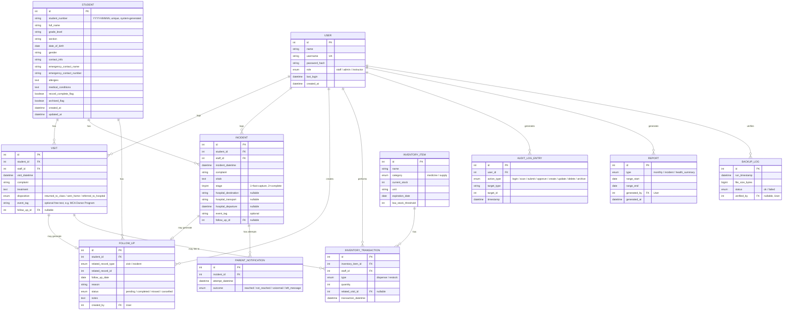

# Entity-Relationship Diagram

**Status: first draft, built from already-documented requirements — not waiting on an external SRS upload.** Every entity below comes directly from the Frontend Context Brief's "Data Entities" section (§5); every relationship is a direct, necessary consequence of behavior already described elsewhere (Modules & Features, the interaction flows). Two things are genuine **design decisions made here, not previously specified**, flagged so they get reviewed rather than assumed final:

1. **`ParentNotification` and `InventoryTransaction` are split into their own tables**, not stored as arrays/logs on their parent record. The source docs describe these as "a log" or "an array of attempts" conceptually — turning that into a proper one-to-many relationship is the standard relational translation, but it's a schema-level choice, not something explicitly dictated before now.
2. **Column types/lengths are reasonable defaults** (e.g., `VARCHAR(10)` for `student_number`), not values anyone specified — adjust freely once real backend work starts.

## Diagram

## Notes for whoever writes the actual migrations

- `student_number`'s uniqueness and format (`YYYY-NNNNN`, sequence resets yearly) should be enforced at the application layer at generation time, not just a DB unique constraint — the format itself isn't something MySQL validates natively.
- `VISIT.follow_up_id` and `INCIDENT.follow_up_id` being nullable FKs (rather than `FOLLOW_UP` holding two nullable FKs back to each) reflects that a visit/incident either has a follow-up or doesn't — pick whichever direction is cleaner once an ORM is in play; Eloquent handles either.
- `AUDIT_LOG_ENTRY.target_type` + `target_id` is a simple polymorphic-style reference (any record type, not a dedicated FK per table) — matches Laravel's own polymorphic relations pattern if that's the implementation approach chosen.
- Nothing here is blocked on the SRS anymore — this **is** the first draft of that artifact, built from what the project already committed to.
