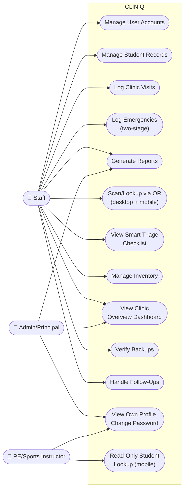

# Use-Case Diagram

**Status: first draft, built from already-documented requirements.** Actors and access levels come directly from the Access Summary table already established in Modules & Features — nothing here grants or denies access differently than what's already decided. Represented as both a visual overview (Mermaid) and a detailed table (Mermaid's UML use-case notation support is too limited for a system this size to be genuinely readable as a diagram — a table communicates the same facts more clearly for ~50+ individual use cases across 3 roles).

## Visual Overview

## Detailed Use Cases by Role

### 👤 Staff (Nurse / Clinic Assistant) — Full access across every module

| Use Case | Module |
|---|---|
| Log in / log out | User Management |
| Manage user accounts (add/edit/deactivate, all 3 roles) | User Management |
| Add/edit/archive student records | Student Records |
| Resolve incomplete-record queue entries | Student Records |
| Log a clinic visit, with Smart Triage checklist | Clinic Visit Monitoring |
| Generate/approve excuse letters | Clinic Visit Monitoring |
| Log PE/Sports injury referrals | Clinic Visit Monitoring |
| Record an emergency incident (Stage 1: fast-capture) | Emergency Response |
| Complete an incident record (Stage 2) | Emergency Response |
| Log hospital referral details | Emergency Response |
| Log parent notification attempts and outcomes | Emergency Response |
| Prompt and record a Follow-Up (from a visit or incident) | Clinic Visit Monitoring / Emergency Response |
| Resolve a Follow-Up's status | Clinic Visit Monitoring / Emergency Response |
| Generate monthly/incident/health-summary reports | Reports Generation |
| Generate and print a student's QR code | QR Digital Health ID |
| Scan/enter a Student Number (computer or mobile) | QR Digital Health ID |
| Use mobile Emergency button | QR Digital Health ID |
| Dispense/restock inventory items | Inventory Tracker |
| Manage inventory item thresholds and expiration dates | Inventory Tracker |
| View Clinic Overview Dashboard | Clinic Overview Dashboard |
| Check/verify backup status | Backup Verification Assistant |

### 👤 Admin/Principal — Read-only, Reports + Dashboard only

| Use Case | Module |
|---|---|
| Log in / log out, change own password | User Management |
| View and print monthly/incident/health-summary reports | Reports Generation |
| View Clinic Overview Dashboard | Clinic Overview Dashboard |

### 👤 PE/Sports Instructor — Mobile-only, read-only

| Use Case | Module |
|---|---|
| Log in / log out, change own password | User Management |
| Scan or enter a Student Number (mobile only) | QR Digital Health ID |
| View a student's full profile, read-only | Student Records (via QR lookup) |
| View a student's visit/incident history, read-only | Clinic Visit Monitoring / Emergency Response (via history, no direct module access) |

**Explicitly not a use case for this role:** recording anything, editing anything, or any action beyond viewing — enforced both in the UI (no action buttons shown) and, per `.claude/skills/cliniq-audit-trail/`, at the API layer.

## Notes

- Every use case above, regardless of role, implicitly includes "gets logged to the audit trail" — not listed as a separate use case per row, since it's a cross-cutting requirement applying to all of them uniformly (Modules & Features, "Audit Trail" section).
- Future-development roles (Canteen Staff) are deliberately excluded from this diagram — it reflects current, built scope only. See `08-Logs/Issues-and-TODOs.md` for what that role would add if undeferred.
